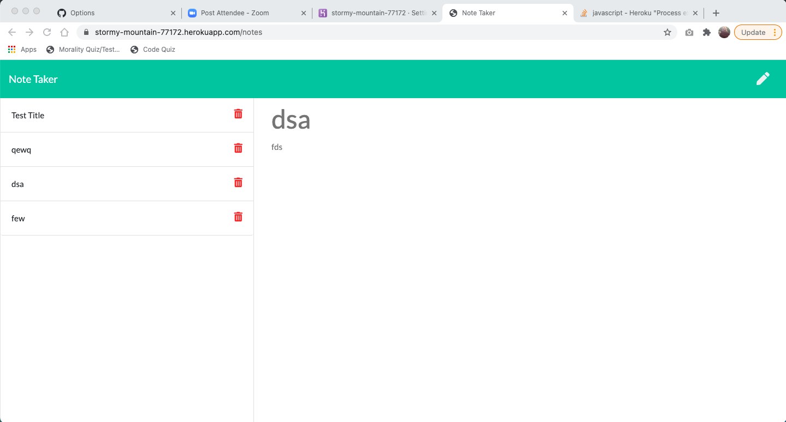

# Note Taker

## Table of Contents
  
1. [Description](#description)
2. [Installation](#installation)
3. [Usage](#usage)
4. [Contributors](#contributors)
5. [Testing](#testing)

[License](#license)

### Description
This application is used to help create easy to access notes on your web browser. You can add as many notes as needed with a header and text content
  
### Installation
you will need to use the following: npm i init -y, npm i express, and npm i generate unique id.
  
### Usage
This application is used to This application will be used to capture notes within your web browser.

### Questions

If you have any question you can reach me by: 

GitHub: www.github.com/paytoncali

Email Address: paytoncaliw@gmail.com

### Deployment
[Link to Repo]https://github.com/paytoncali/note-taker.git
[Link to Application]https://stormy-mountain-77172.herokuapp.com/

 